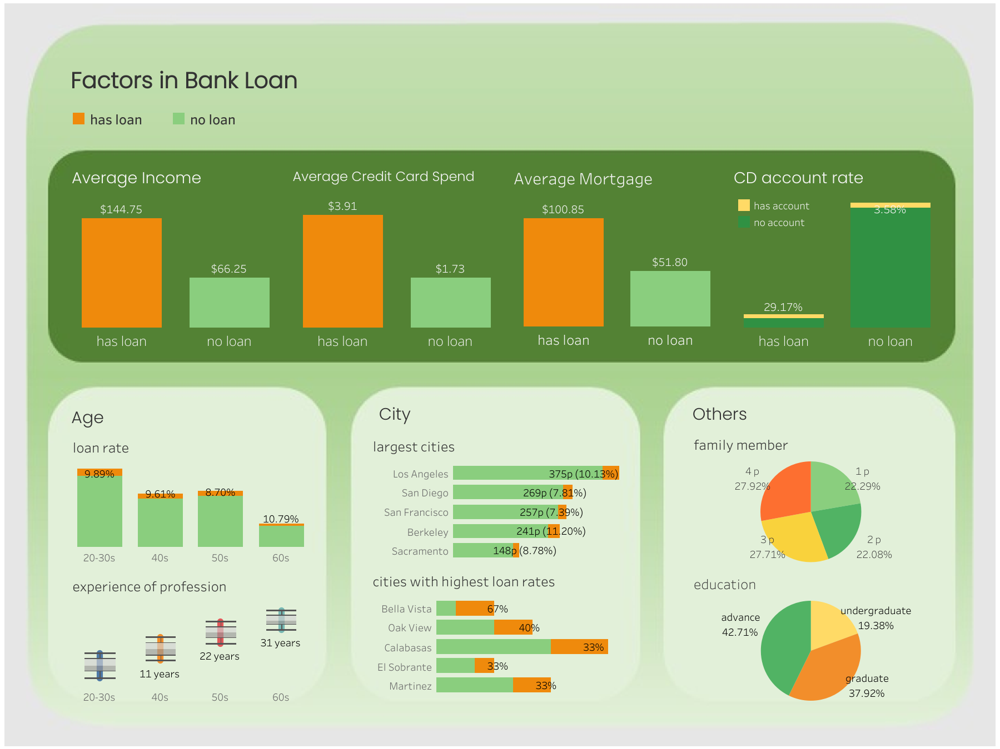
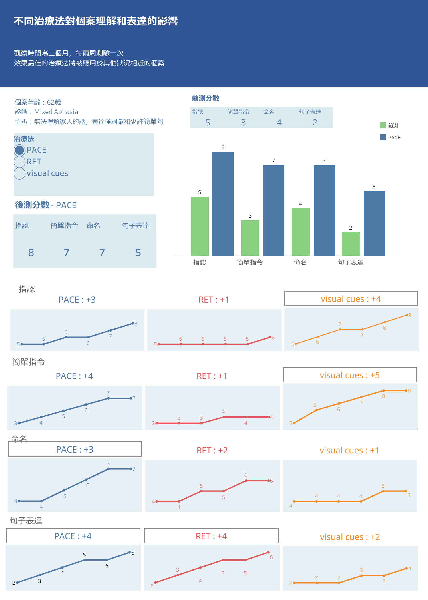

# 數據分析作品集
## 專案一：南亞電信客戶流失
透過分析南亞電信2015年8-9月的資料，探討客戶流失的原因並提除建議  
### 使用工具：
- Python
- Tableau
### ⭐商業簡報：[Tableau完整版](https://public.tableau.com/app/profile/yii.chen/viz/southasiatelecomchurn/1_1)
  
資料來源：[https://www.kaggle.com/datasets/mahreen/sato2015](https://www.kaggle.com/datasets/mahreen/sato2015)  
## 專案二：銀行貸款申請  
Thera Bank的經理想將有債務的客戶轉換為貸款客戶，行銷部門要設計活動提高轉換率，資料呈現去年有轉換和沒有轉換的客戶特徵，分析目標是找出轉換為貸款客戶的共通特徵，讓今年的活動能更精準的針對目標客戶設計  
### 使用工具：
- Python  
- Pandas  
- Seaborn
- Scikit-Learn
### 分析結果(擷取部分)：
針對符合以下任一條件的客戶，可作為推銷銀行貸款活動的主要目標
- 收入超過113.5
- 信用卡每月消費超過2.95
- 來自Santa Clarita、Los Altos、Walnut Creek、Los Angeles、Berkeley或Sacramento
- 教育程度研究所以上
- 家庭人數大於兩人
- 有儲蓄戶頭
### ⭐完整流程 & 分析結果：[點這裡看Notebook](Python-貸款申請.ipynb)  
### 視覺化儀表板：[在Tableau上觀看](https://public.tableau.com/app/profile/yii.chen/viz/_17539345831840/1)  

資料來源：[https://www.kaggle.com/datasets/ahmadrafiee/bank-personal-loan](https://www.kaggle.com/datasets/ahmadrafiee/bank-personal-loan)  
## 專案三：電商平台用戶行為
透過電商平台上的用戶行為找出和滿意度之間的關聯，提升客戶滿意度  
### 使用工具：
- Python
- Seaborn
- Matplotlib
### 分析結果(僅擷取部分)：
年輕、購買較多商品、消費金額高、對商品有正向評價、金等會員、居住在紐約或舊金山、不使用折價券或較常購買的顧客，有著較高的滿意度，反之，年長、較少購買、會員等級較低、住在芝加哥或邁阿密、使用折價券或對商品評價較低的顧客有較低的滿意度
### ⭐完整分析流程 & 商業建議：[點這裡看Notebook](Python-電商客戶行為.ipynb)  
資料來源：[https://www.kaggle.com/datasets/uom190346a/e-commerce-customer-behavior-dataset](https://www.kaggle.com/datasets/uom190346a/e-commerce-customer-behavior-dataset)
## 專案四：餐廳、成員和訂單
這份資料集中共有十張表格，內容包含成員的點餐紀錄及餐廳和訂單的詳細資料  
目標是用SQL撈取資料後做join或聚合函數等，回答一些問題或進行探索性統計分析  
### 使用工具：
- Python
- Pandas
- MySQL
### ⭐分析結果：[點這裡看Notebook](SQL-餐廳、成員和訂單.ipynb)  
資料來源：[https://www.kaggle.com/datasets/vainero/restaurants-customers-orders-dataset](https://www.kaggle.com/datasets/vainero/restaurants-customers-orders-dataset)
## 專案五：不同治療法的治療效果
語言治療中使用到三種治療法，儀表板為每個治療法對個案治療效果的視覺化結果
### 使用工具：
- Excel
- Tableau  

### 在網頁上看：[Tableau](https://public.tableau.com/app/profile/yii.chen/viz/_17555740030890/2_2)  
## 🎯Bonus: 機器學習-HR 預測離職
### 使用模型：
- Logistic Regression
- Decision Tree
- Random Forest
- XGBoost
### ⭐結果：[點這裡看Notebook](機器學習-HR預測離職.ipynb)
